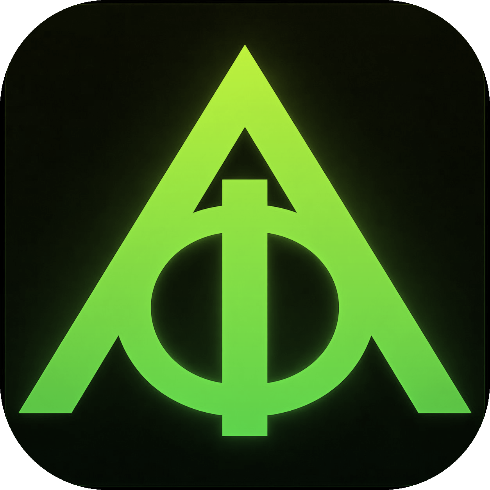

<p align="center">
  
</p>

<h1 align="center">Logosforge</h1>

<p align="center"><strong>A narrative operating system for structured writing.</strong></p>

<p align="center">Plan, write, and evolve your story with AI — without losing control.</p>

<p align="center"><strong>Status: 0.9.0-alpha</strong> — private alpha. Feature-frozen, focused on stability/data-safety. Expect rough edges. <strong>Back up your work</strong> (see below).</p>

---

> [!IMPORTANT]
> **Alpha — back up before serious writing.** Your work lives in a local SQLite
> database and autosaved project files, with automatic version snapshots — but
> this is alpha software. Use **File → Export → JSON / Full Project** regularly,
> and keep copies. See [Backup & Restore](docs/BackupRestore.md) and
> [Data Safety](docs/DataSafety.md).

## What it is

Logosforge unifies **writing, structure, and AI** in one place. Editors let you write but not structure; planners organize but don't help you write; AI tools generate text but ignore narrative intent. Logosforge does all three together — a PySide6 desktop app with a SQLite backend, built for novelists, screenwriters, and narrative designers who want deep structural awareness alongside their prose.

## Narrative Engines

Pick a **Narrative Engine** per project — it shapes how every section (Outline, Plot, Timeline, Graph, Assistant) reasons about your story:

- **Novel** — Parts / Chapters / Scenes
- **Screenplay** — Acts / Sequences / Scenes / Beats
- **Stage Script** — Acts / Scenes / Beats / Entrances·Exits / Cues
- **Graphic Novel** — Issues / Chapters / Pages / Panels (page canvas, panel editor, visual-motif graph, image-prompt export)
- **Series** — Seasons / Episodes / A·B·C plots / Arcs

A separate **Writing Format** controls how the manuscript renders/exports (Prose, Screenplay, Stage Script, Graphic Novel Script, …).

## Highlights

- **Manuscript** — distraction-free editor, focus mode, format-aware blocks, DOCX/text export.
- **Structure** — Outline (AI-generated, engine-aware, template-driven), Story Grid, Multi-Plot, Timeline, act/beat analysis.
- **PSYKE Story Bible** — characters, places, objects, themes, lore, relations, temporal progressions, and engine-specific memory (e.g. Graphic Novel visual identity).
- **AI Assistant** — engine-aware critique, inline editing, COUNTERPART mode, adaptive modes, a layered context pipeline, and safe propose-then-confirm actions (e.g. generate a structured outline).
- **Graph** — focused, filterable views of motifs, characters, causality, and continuity.
- **Local or cloud AI** — any OpenAI-compatible endpoint (LM Studio, Ollama, OpenAI, …).
- **HTTP API** — the Python core doubles as an authoritative backend, so the same product can be driven by a shared web/desktop UI (see below).

## HTTP API (shared React UI)

Beyond the desktop app, the Python core is exposed as a clean **FastAPI** service so a single React UI can run in two environments that differ only in transport, not in logic:

- **Electron desktop** — React UI + a locally-launched API bound to `127.0.0.1` (offline / local-first).
- **Web / PWA** — the same React UI calling a LAN or remote API base URL.

The API wraps existing core services (no duplicated business logic), returns stable Pydantic DTOs, routes every mutation through the safe action layer, and emits change events (SSE + polling) for live UI sync. It runs independently of the desktop app, which is unaffected.

```bash
pip install -r requirements.txt        # installs fastapi + uvicorn
python -m logosforge.api             # desktop mode, http://127.0.0.1:8765
python -m logosforge.api --mode lan --host 0.0.0.0 --port 9000
```

Interactive docs and the schema are auto-generated at `/docs` and `/openapi.json`. **Full contract, endpoints, payloads, events and config:** [`docs/API.md`](docs/API.md).

> **Alpha note:** for this alpha the API is intended for **desktop / localhost**
> use. `--mode lan` / `--mode remote` are **experimental** and deferred to beta;
> if you expose the API on a network, set an auth token. The desktop app does not
> require the API.

## Install & Run

**Requirements:** Python **3.10+** and pip. Core dependencies (`requirements.txt`):
PySide6 (Qt 6), FastAPI, Uvicorn.

**Optional** (only for those export formats — install if you want them):

```bash
pip install reportlab    # PDF export
pip install python-docx  # DOCX export
```

Without these, PDF/DOCX export shows a readable "install the optional library"
message; **Markdown / TXT / Fountain / FDX / HTML / JSON** export work with no
extra libraries.

```bash
python3 -m venv venv
source venv/bin/activate
pip install -r requirements.txt
python3 run.py
```

**Windows (PowerShell):**

```powershell
python -m venv venv
venv\Scripts\activate
pip install -r requirements.txt
python run.py
```

**Run the tests:**

```bash
python -m pytest tests/
```

## AI Providers

Logosforge talks to any **OpenAI-compatible** endpoint plus Anthropic, through a
single in-app provider setting (Assistant → Settings). No keys are stored in
your project files or exports.

| Provider | API key | Default endpoint |
|----------|---------|------------------|
| **LM Studio** (local) | none | `http://localhost:1234/v1` |
| **Ollama** (local) | none | `http://localhost:11434/v1` |
| **OpenAI** | required | `https://api.openai.com/v1` |
| **Anthropic** | required | `https://api.anthropic.com` |
| **OpenRouter** | required | `https://openrouter.ai/api/v1` |

Local models get a longer default timeout (300s vs 120s for cloud), configurable
in Assistant Settings. Step-by-step setup: **[`docs/AI_SETUP.md`](docs/AI_SETUP.md)**.

## Known Limitations (Alpha)

- Some intelligence services (Knowledge Graph, Semantic Continuity, Decision
  Radar, Guided Workflows) ship as **services + Logos/Assistant surfaces**;
  their dedicated **UI panels are deferred to beta**.
- **PDF/DOCX** export needs optional libraries (see Install). **FDX** and **LAN/
  remote API** are experimental.
- Plot/Timeline are derived from scene fields (no separate rich models).
- Grammar/spell is a basic rule-based checker.
- Single-user, **local-only** — no cloud sync or collaboration.

Full list: **[`docs/KNOWN_LIMITATIONS_ALPHA.md`](docs/KNOWN_LIMITATIONS_ALPHA.md)**.

## Documentation

- **[User Guide (Alpha)](docs/USER_GUIDE_ALPHA.md)** · **[AI Setup](docs/AI_SETUP.md)** · **[Troubleshooting](docs/TROUBLESHOOTING.md)**
- **[Alpha Scope](docs/ALPHA_SCOPE.md)** · **[Known Limitations](docs/KNOWN_LIMITATIONS_ALPHA.md)** · **[Alpha Test Plan](docs/ALPHA_TEST_PLAN.md)**
- **[Backup & Restore](docs/BackupRestore.md)** · **[Data Safety](docs/DataSafety.md)** · **[Export / Interchange](docs/Interchange.md)**
- Full index: **[`docs/index.md`](docs/index.md)**

## Tech Stack

| Component | Technology |
|-----------|-----------|
| Language | Python 3.10+ |
| UI | PySide6 (Qt 6) · shared React UI via HTTP API |
| Data | SQLModel + SQLite |
| AI | OpenAI-compatible API (local or cloud) |
| API | FastAPI + Uvicorn (Electron desktop / Web · PWA) |
| Architecture | MVC with layered context engines |
